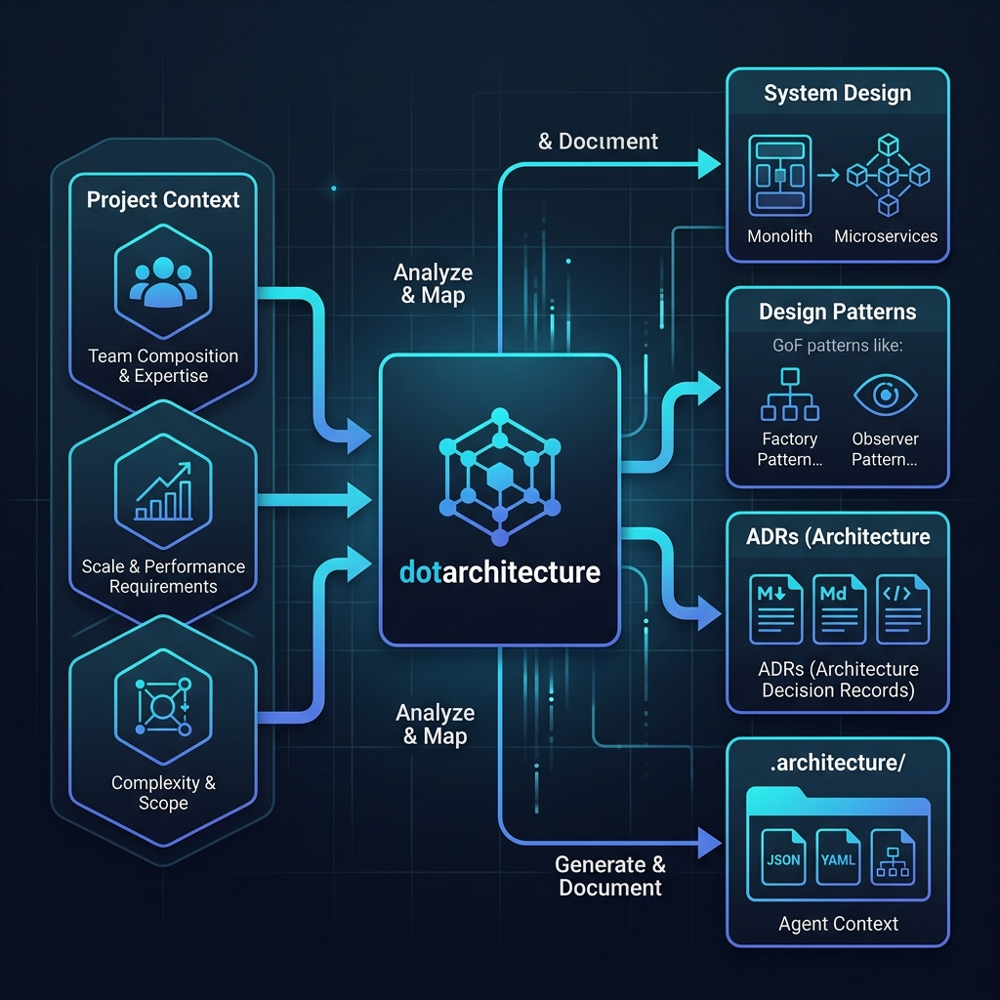

# dotarchitecture

[](https://www.npmjs.com/)
[](https://github.com/andrecodexvictor/dotarchiteture/actions)
[](https://opensource.org/licenses/MIT)

**dotarchitecture** is an open-source, MIT-licensed developer toolkit and active codebase validator that complements the `dotstack` and `dotcontext` ecosystem. It evaluates your project context (team size, complexity, scaling limits, maturity) to automatically recommend, document, and enforce architectural structures.

Instead of debating directory layouts or manually drafting files, **dotarchitecture** compiles system decisions, compiles Architecture Decision Records (ADRs), creates active agent guides, and monitors code imports to prevent structural drift.



---

## What Dotarchitecture Is

`dotarchitecture` is three core capabilities in a single tool:
1. **A Design & Decision Engine**: Evaluates constraints against configurable scoring thresholds and overrides to recommend monoliths, modular monoliths, microservices, event-driven, or serverless models.
2. **An Active Codebase Validator**: Scans workspace files and parses static code imports to actively detect layout drift and prohibited dependency linkages (e.g. domain layers importing adapters).
3. **An MCP and Agent Interface**: Launches a built-in Model Context Protocol (MCP) server so coding assistants (like Cursor, Claude Code, Roo Code, and Codex) can query rules, verify layout files, and fetch patterns dynamically.

---

## Why Dotarchitecture Exists

Most software projects suffer from three architectural problems:
* **Over-engineering**: Small startup teams scaffolding complex microservices before validating the product domain.
* **Structural Drift**: Human or AI coding agents placing files in arbitrary directories, bypassing clean boundaries.
* **Documentation Disconnect**: ADRs and architecture guidelines locked in wikis that developers and coding tools never read.

`dotarchitecture` resolves this layer by coupling system decision matrixes with active filesystem linting and durable context directories (`.architecture/` and optional `.context/dotarchitecture/`) that travel with the codebase.

---

## Getting Started / Como Começar

### Path 1: Model Context Protocol (MCP) — Recommended
Use this path when you want an AI assistant (such as Claude Code, Cursor, or Gemini) to query architectural decisions, run validation checks, and verify imports directly as tool calls.

#### 1. Install the MCP Server
```bash
npx @dotarchitecture/mcp install
```
The installer will automatically detect compatible AI tools on your system (e.g., Claude Code, Cursor, Windsurf, VS Code Copilot) and configure the server.

#### 2. Run Tools Inside the Agent
Ask your agent:
* *"init the architecture config"*
* *"design the system architecture based on my context"*
* *"verify if my codebase complies with the design"*

---

### Path 2: Standalone CLI
Use this path to execute local commands, initialize config schemas, run build pipeline verifications, or trigger development event hooks.

#### 1. Generate Configuration Template
```bash
npx dotarchitecture init
```
This generates a commented `dotarchitecture-input.yaml` in your project root.

#### 2. Generate Decisions & ADRs
```bash
npx dotarchitecture design
```
Reads `dotstack.yaml` (if present) or `dotarchitecture-input.yaml`, and compiles:
* `dotarchitecture.yaml` (record of choices & rejected paths)
* `./docs/adr/` (ADR-001 Base System, ADR-002 Testing, and folder layout maps)
* `./.architecture/` & `./.context/dotarchitecture/` (durable agent context)

#### 3. Run Active Code Validation
```bash
npx dotarchitecture verify
```
Scans repository files and imports. Exits with code `1` and prints violations if any boundary rules are broken.

---

## Core Concepts

### 1. Shared Context & Mirroring
One `.architecture/` folder stores durable project choices, which is created regardless of other dependencies to make rules visible to humans and agents. If a `.context/` folder (conforming to `vinilana/dotcontext`) exists, these files are mirrored under `.context/dotarchitecture/`.

```text
.architecture/ (or .context/dotarchitecture/)
├── architecture.yaml   # Machine-readable record of recommended styles
└── README.md           # Agent-focused instructions for layer imports and coding rules
```

### 2. Active Verification
The `verify` engine parses code files (TS, JS, Go, Python, Java) using regular expressions to detect dependencies.
* **Hexagonal Pattern Rules**: Ensures code in `domain/` never imports from `adapters/` or `infrastructure/`.
* **Layered Pattern Rules**: Ensures code in `domain/` or `services/` never imports from `presentation/` or `controllers/`.
* **MVC Pattern Rules**: Warns if complex structures (like ports/adapters folders) are introduced inside simple MVC models.

---

## CLI Reference

| Command | Flags | Role |
| :--- | :--- | :--- |
| `init` | `-o, --output <path>` | Creates a template `dotarchitecture-input.yaml` file. |
| `design` | `-f, --file <path>`, `-o, --output <path>` | Evaluates context, queries catalog, compiles ADRs and agent context. |
| `verify` | `-d, --decision <path>` | Scans workspace directories and imports to check for rules compliance. |
| `mcp` | — | Launches the Model Context Protocol stdio server. |

---

## MCP Tools Reference

When running the MCP server, `dotarchitecture` exposes two primary tools to the client agent:

### 1. `get_architecture_rules`
* **Purpose**: Evaluates project configuration context and generates architectural decisions.
* **Arguments**:
  * `inputFile` (optional string): Path to configuration file.

### 2. `run_verify_checks`
* **Purpose**: Scans workspace files and dependency linkages, evaluating them against target patterns.
* **Arguments**:
  * `decisionFile` (optional string): Path to the decision YAML file.

---

## Local Development & Setup

To clone the repository and run development tests:

```bash
# Clone
git clone https://github.com/andrecodexvictor/dotarchiteture.git
cd dotarchiteture

# Install dependencies
npm install

# Build TypeScript
npm run build

# Run Jest Test Suite
npm run test
```

---

## Author & License

* **Author**: André Victor A. O. Santos
* **License**: Licensed under the MIT License - see the [LICENSE](LICENSE) file for details.
