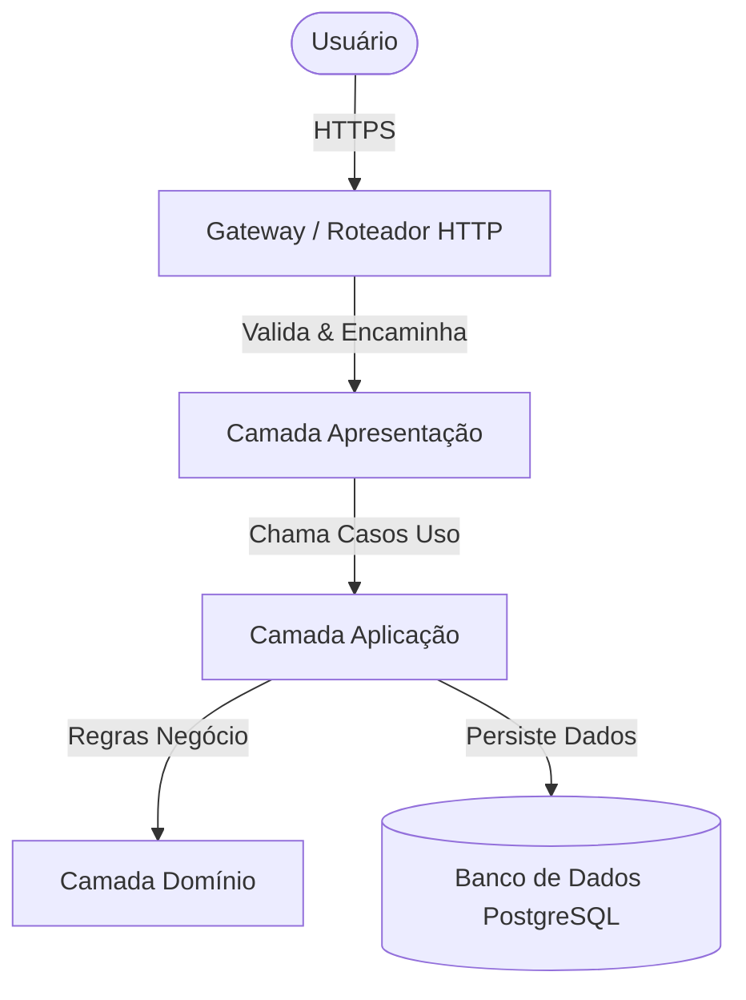

# C4 Model Diagram Suggestion (Mermaid)

```mermaid
graph TD
    User([Usuário]) --> |HTTPS| Router[Gateway / Roteador HTTP]
    Router --> |Valida & Encaminha| Presentation[Camada Apresentação]
    Presentation --> |Chama Casos Uso| Application[Camada Aplicação]
    Application --> |Regras Negócio| Domain[Camada Domínio]
    Application --> |Persiste Dados| DB[(Banco de Dados PostgreSQL)]
```
